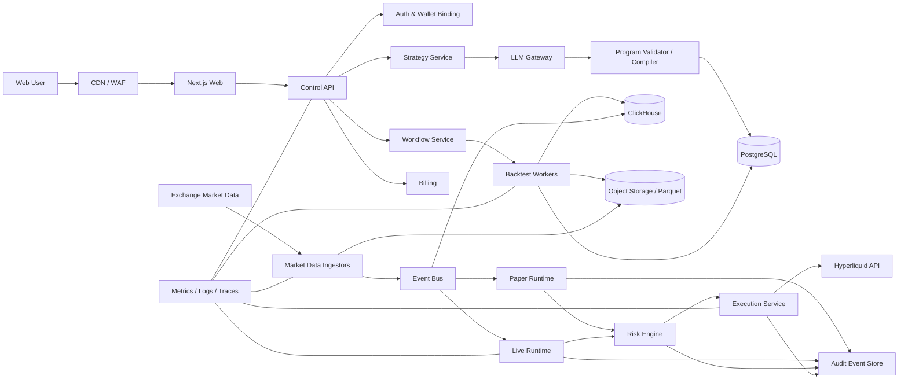
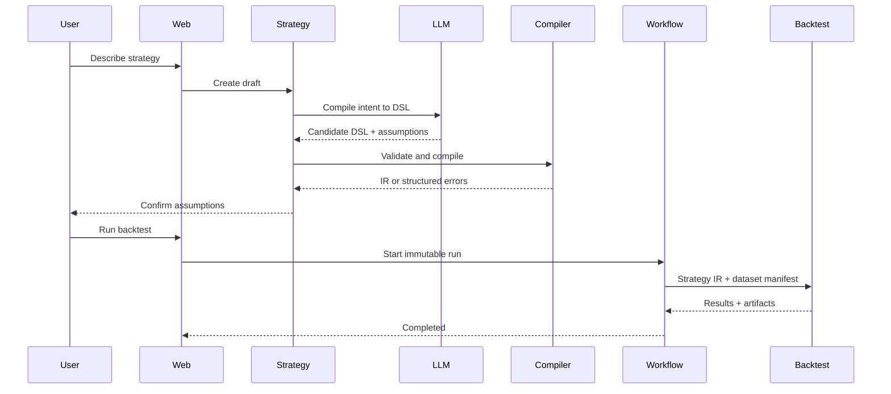
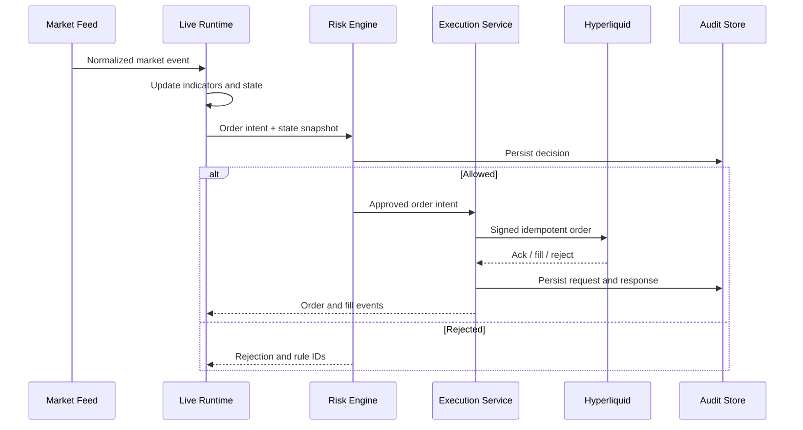

# Technical architecture: Crypto Strategy Studio

English | [简体中文](TECH_ARCHITECTURE.zh-CN.md)

Status: Draft v0.1  
Corresponding product specification: [PRODUCT_SPEC.md](PRODUCT_SPEC.md)

## 1. Architectural goals

The system has to satisfy all of these at once:

- Strategy results are reproducible.
- The AI is not inside the trusted trading boundary.
- Backtest, paper, and live share one strategy semantics.
- Market data is traceable to its source, time, and quality.
- Wallet authorization is minimal, and the platform holds no assets.
- Orders are idempotent, reconcilable, auditable, and can be stopped in an
  emergency.
- The MVP can iterate fast while the critical services still scale
  independently.

## 2. Core principles

### 2.1 The AI programs; a deterministic sandbox executes

The LLM emits a constrained TypeScript program that calls the platform's Strategy
SDK. The program goes through AST static checks, TypeScript compilation,
capability analysis, and content hashing, and then runs in a QuickJS/WASM
sandbox. Backtest, paper, and live only run verified, hash-pinned programs; the
LLM cannot call a trading endpoint. The internal IR is only responsible for
auditing, capability declarations, and optimization, and no longer has to express
every user intent.

### 2.2 The control plane is isolated from the trading plane

- Control plane: users, strategies, versions, backtest jobs, billing, and pages.
- Data plane: market data collection, normalization, and storage.
- Trading plane: live strategy execution, risk control, signing, and order
  placement.

The trading plane uses its own network, credentials, permissions, and deployment.
Compromising the control plane must not directly grant the ability to place
orders.

### 2.3 Raw events are immutable; derived results are rebuildable

Raw market data, strategy versions, order intents, risk decisions, exchange
responses, and fills are all append-only. Charts, indicators, and reports are
rebuildable derived results.

### 2.4 One semantics, several run modes

Backtest, paper, and live use the same strategy IR, indicator implementations,
and signal state machine. They swap only:

- The data clock.
- The broker adapter.
- The fill model.
- Where capital and positions come from.

## 3. Overall architecture



## 4. Services

### 4.1 Web app

Responsible for:

- Login, wallet binding, and plan pages.
- The conversation, rule tree, and strategy version interfaces.
- Charts, backtest reports, and the paper/live console.
- Share pages, the strategy library, and risk settings.

Not responsible for: strategy computation, key storage, trade signing, or being
the authority on state.

### 4.2 Control API

Responsible for:

- The public API / BFF.
- Permission, quota, and resource ownership checks.
- Strategy, backtest, deployment, and notification commands.
- Aggregating PostgreSQL and analytics results.

Every state-changing request must use an idempotency key.

### 4.3 LLM gateway

Responsible for:

- Wrapping several model providers.
- Managing system prompts, tool definitions, and model versions.
- Structured output, retries, rate limiting, and cost accounting.
- Recording input and output hashes, the model, and the prompt version.
- Prompt-injection and sensitive-content protection.

The LLM gateway holds no trading credentials and cannot reach the execution
service.

### 4.4 Strategy service

Responsible for:

- Storing natural-language intents and strategy versions.
- Calling the LLM gateway to generate candidate strategy programs.
- Running AST safety, type, SDK capability, and resource validation.
- Compiling and producing an immutable program hash and the internal IR.
- Generating the natural-language explanation and the rule tree.
- Managing strategy state and the live-eligibility gate.

### 4.5 Market data ingestors

Responsible for:

- Fetching market data over WebSocket and REST.
- Storing raw messages with their receive time.
- Handling reconnects, heartbeats, rate limits, and backfills.
- Checking for time going backwards, duplicates, sequence gaps, and outliers.
- Normalizing symbol, venue, time, price, and quantity precision.

Launch data:

- Candles/OHLCV.
- Trades.
- Mark, oracle, and mid price.
- Funding rate.
- Open interest.
- L2 book snapshots and updates, reserved for the P1 slippage model.
- Liquidation events, reserved for P1 analysis.

The implemented foundation for historical backtesting is in
[the historical market data pipeline](DATA_PIPELINE.md): raw granularity is
normalized to 1m, stored as immutable monthly Parquet with SHA-256 manifests.
Kraken `XBTUSD` is the decade-long single-market spot baseline, Binance Vision
`BTCUSDT` is used for fast bulk verification, and the Hyperliquid API for recent
perpetual data. Series from different venues or instruments are never silently
concatenated.

### 4.6 Backtest service

Responsible for:

- Loading a pinned strategy IR version and a data snapshot.
- Computing indicators, signals, orders, fills, funding, and equity.
- Simulating fees, slippage, leverage, and liquidation.
- Producing metrics, the trade list, and visualization data.
- Emitting a reproducible manifest.

A backtest manifest contains at least:

- strategy_version_id and the IR hash.
- engine_version.
- The dataset snapshot/version.
- symbol, venue, interval, start/end.
- Fee, funding, slippage, and liquidation configuration.
- Initial capital and risk configuration.
- The random seed, if randomized simulation is used.

### 4.7 Paper runtime

Responsible for:

- Consuming live market events.
- Using the same strategy state machine as live.
- Producing fills through a simulated broker.
- Persisting positions, equity, and a run heartbeat.
- Backfilling events after a reconnect.

The paper runtime is the pre-release validation environment for the live runtime.
It must never contain a second, simplified copy of the strategy logic.

### 4.8 Live runtime

Responsible for:

- Loading exactly one approved strategy version.
- Consuming live events and producing order intents.
- Submitting every intent to the risk engine.
- Maintaining strategy state, indicator windows, and a run heartbeat.
- Entering `PAUSED_SAFE` when it cannot recover or reconcile.

The live runtime cannot reach the execution service around the risk engine.

### 4.9 Risk engine

Responsible for:

- Validating the allowed venue, symbol, side, and order type.
- Limiting per-trade, per-strategy, and per-account position and leverage.
- Checking the daily loss limit and the maximum drawdown.
- Checking data freshness, spread, and abnormal prices.
- Allowing only reduce-only on a conflict.
- Returning `ALLOW`, `REJECT`, or `ALLOW_WITH_ADJUSTMENT`.

Every risk decision must store the input snapshot, the rules that fired, and the
output. A single free-text reason is not acceptable.

### 4.10 Execution service

Responsible for:

- Signing trading actions with a restricted API wallet.
- Translating internal orders into venue requests.
- Guaranteeing idempotency with client order IDs.
- Managing submit/cancel/replace and retries.
- Receiving order, fill, and position events.
- Reconciling with the venue periodically.
- Enforcing the dead man's switch.

The execution service does not parse strategies and does not call an LLM.

### 4.11 Workflow service

For long jobs and reliable state transitions:

- Data backfills.
- Backtest jobs.
- Paper/live deployment and shutdown.
- Wallet authorization verification.
- Trade state reconciliation.
- Notification retries.
- Billing and quota resets.

## 5. The strategy program and the internal IR

User intent is now carried primarily by the strategy program. The full program
model and current implementation are in
[strategy program design](STRATEGY_PROGRAM.md). The DSL kept in this section
serves as an optional internal IR, rule summary, static capability description,
and audit representation; full details are in
[internal DSL/IR design](STRATEGY_DSL.md).

### 5.1 Design principles

- User programs must execute through the constrained Strategy SDK and an isolated
  sandbox.
- JSON-serializable, with an explicit version.
- Every field has a unit and a data type.
- Conditions can be explained and plotted.
- The internal IR can extract data dependencies, actions, state, and risk; it is
  not required to reconstruct all program control flow.
- Trading actions must still become structured order intents and pass through an
  independent risk engine.
- New semantics arrive through a version bump and never silently change an old
  strategy's results.
- Every strategy is explicitly labeled `BACKTEST_ONLY`, `PAPER_ELIGIBLE`, or
  `LIVE_ELIGIBLE`.

### 5.2 Example

```json
{
  "dslVersion": "1.0",
  "market": {
    "venue": "hyperliquid",
    "instrument": "BTC-PERP",
    "interval": "1h"
  },
  "features": {
    "emaFast": { "type": "ema", "source": "close", "length": 20 },
    "emaSlow": { "type": "ema", "source": "close", "length": 50 },
    "funding": { "type": "funding_rate" },
    "oiChange24h": { "type": "pct_change", "source": "open_interest", "periods": 24 }
  },
  "entry": {
    "side": "long",
    "all": [
      { "crossesAbove": ["emaFast", "emaSlow"] },
      { "lt": ["funding", 0] },
      { "gt": ["oiChange24h", 0.05] }
    ],
    "cooldownBars": 12
  },
  "exit": {
    "stopLoss": { "type": "percent", "value": 0.02 },
    "takeProfit": { "type": "riskReward", "value": 2.0 },
    "maxHoldingBars": 72
  },
  "sizing": {
    "type": "riskPercent",
    "value": 0.01
  },
  "constraints": {
    "maxLeverage": 2,
    "maxConcurrentPositions": 1
  }
}
```

### 5.3 Validation layers

1. JSON Schema: fields, types, enums, required properties.
2. Semantic validation: references exist, timeframes are sensible, units match.
3. Data validation: the required data is available with enough history.
4. Risk validation: stops, leverage, and sizing are within product limits.
5. Executability validation: the venue supports the corresponding order
   semantics.

### 5.4 Compilation output

The DSL compiles into an immutable strategy IR:

- The indicator dependency DAG.
- The signal boolean expressions.
- The state machine.
- Sizing and exit rules.
- Data warm-up requirements.
- The list of capability dependencies.

The IR is hashed with a canonical serialization, and that hash is part of a
backtest's and a deployment's identity.

## 6. Key data flows

### 6.1 Creating and backtesting



### 6.2 Live controlled execution



### 6.3 Reconciliation and safe pause

1. The execution service periodically pulls exchange orders, fills, balances, and
   positions.
2. It compares them against the internal projection.
3. Small, explainable differences produce a correction event.
4. An unexplainable position difference moves the account to
   `RECONCILIATION_REQUIRED`.
5. The risk engine rejects every order that increases risk, allowing only
   reduce-only.
6. The user and operations are notified, with the full evidence preserved.

## 7. Data architecture

### 7.1 PostgreSQL: authoritative business data

The main entities:

- `users`
- `wallet_connections`
- `strategies`
- `strategy_versions`
- `strategy_compilations`
- `backtest_runs`
- `deployments`
- `risk_policies`
- `order_intents`
- `orders`
- `fills`
- `position_snapshots`
- `subscriptions`
- `notifications`
- `audit_events`

Key principles:

- Strategy versions are immutable.
- Amounts, prices, and quantities use decimal/numeric or fixed-point integers;
  float is never an authoritative trading value.
- All times are UTC with timezone-aware timestamps.
- Business tables use time-ordered IDs such as UUIDv7 or ULID.
- Multi-tenant queries are constrained twice: in the application and in database
  policy.

### 7.2 ClickHouse: market and analytical data

Datasets:

- Normalized trades.
- Candles.
- Mark/oracle/mid prices.
- Funding and open interest.
- L2 snapshots and updates.
- Liquidation events.
- Strategy signal and equity time series.

Partitioned by venue, instrument, and event_date, recording both event_time and
ingestion_time so latency and late events are both visible.

### 7.3 Object storage: raw data and artifacts

- Raw exchange messages, written as compressed hourly Parquet.
- Backtest data snapshot manifests.
- Large backtest results and chart series.
- Exports and audit archives.

Raw data is append-only, and lifecycle policies move hot data to cheaper storage.

### 7.4 Redis

- Short-lived caching.
- Rate limiting and distributed leases.
- The live run-state projection.
- WebSocket fan-out.

Redis is never the sole authoritative store for orders, positions, or strategy
versions.

### 7.5 The event bus

Suggested topics:

- `market.raw.<venue>`
- `market.normalized.<venue>.<instrument>`
- `strategy.signal`
- `order.intent`
- `risk.decision`
- `execution.order`
- `execution.fill`
- `account.reconciliation`
- `notification.requested`

Messages carry an event ID, schema version, event time, ingestion time, producer,
and trace ID.

## 8. Technology choices

### 8.1 Recommended stack

| Layer | Choice | Why |
|---|---|---|
| Web | Next.js + React + TypeScript | SSR, fast product iteration, mature ecosystem |
| UI | Tailwind CSS + shadcn/ui | A consistent design system quickly |
| Charts | TradingView Lightweight Charts | Suits financial candles and custom markers |
| Control API | Fastify + TypeScript | Light, type-friendly, a good balance of performance and plugins |
| Schema | TypeBox/JSON Schema + OpenAPI | One contract shared by the DSL, events, and the API |
| Analytics/backtest | Python + FastAPI workers | A mature data science and validation ecosystem |
| DataFrame | Polars + NumPy | Columnar computation, speed, memory efficiency |
| Acceleration | Numba, only on verified hot paths | Avoids introducing C++/Rust prematurely |
| Workflow | Temporal | Reliable long jobs, retries, and compensation |
| Event bus | NATS JetStream | Relatively light to operate, suits event-driven and durable subscriptions |
| Business database | PostgreSQL | Transactions, constraints, a mature ecosystem |
| Analytical database | ClickHouse | High-frequency time series and large aggregations |
| Cache | Redis | Rate limiting, caching, live state |
| Object storage | S3-compatible storage | Raw data, Parquet, artifacts |
| Identity | Hosted OIDC + SIWE wallet binding | Reduces the authentication security burden |
| Payments | A pre-screened merchant of record or payment provider | Crypto-trading-adjacent software may be a restricted business; Stripe cannot be assumed |
| Observability | OpenTelemetry + the Grafana stack | Unified traces, metrics, logs |
| Error tracking | Sentry | Frontend and backend exception aggregation |
| IaC | Terraform | Reviewable, reproducible infrastructure |
| CI/CD | GitHub Actions | Standard test, build, and deploy flows |

### 8.2 Why TypeScript plus Python

- TypeScript carries the product, API, live connections, and trading
  integrations, reducing frontend/backend contract friction.
- Python carries research, indicators, and backtesting, using the mature
  numerical ecosystem.
- The two connect through versioned JSON Schema, events, and gRPC/HTTP
  interfaces.
- The MVP introduces neither Rust nor Go; a local service is rewritten only after
  market data throughput or execution latency is measured to be the bottleneck.

### 8.3 Backtest engine strategy

No open-source backtest framework is adopted directly as the product's
authoritative engine. They can inform the design or cross-validate results, but
the core engine must control these crypto perpetual semantics:

- Funding timing and computation.
- The difference between mark/oracle and traded price.
- Maker/taker determination.
- Leverage, margin, and liquidation.
- A 24/7 timeline.
- Data gaps and venue-specific rules.

The MVP uses an event-driven bar-level engine; P1 adds trade and L2-level fill
simulation.

### 8.4 LLM strategy

The product is not bound to one model:

- Support at least two providers through a provider adapter.
- Use structured output with a strict schema.
- Maintain a fixed strategy-intent test set.
- Evaluate models on compile success rate, semantic correctness, latency, and
  cost.
- A model upgrade must run the regression suite and must never silently affect
  existing strategies.

The LLM is never used for authoritative numerical computation; every indicator,
return, and risk number comes from deterministic code.

## 9. Deployment

### 9.1 MVP

- AWS as the primary cloud.
- ECS Fargate for the API, ingestors, and workers, avoiding premature Kubernetes
  maintenance.
- RDS PostgreSQL.
- ElastiCache Redis.
- S3 for raw market data and Parquet.
- ClickHouse Cloud for analytical data.
- Temporal Cloud for workflows.
- NATS as a managed service or a small highly available cluster.
- Cloudflare for DNS, CDN, WAF, and baseline DDoS protection.

### 9.2 Regions

The control plane starts in one primary region. Market data collection and trade
execution pick a region with good network quality to the venue, decided by actual
latency testing rather than assuming a lowest-latency region at design time.

The system is not high-frequency trading at first, so reliability and data
consistency outrank sub-millisecond latency.

### 9.3 Environments

- Local: Docker Compose against a simulated venue.
- Dev: a shared development environment, testnet/paper only.
- Staging: a scaled-down production topology allowing controlled testnet use.
- Production: paper and live credentials, networks, and database permissions are
  isolated.

## 10. Security architecture

### 10.1 Wallets and keys

- Seed phrases and main wallet private keys are never collected.
- The user signs the API wallet authorization client-side.
- The API wallet's private key is stored encrypted in a KMS/HSM-protected key
  system.
- Decryption and signing happen only inside the isolated execution service.
- Each user and account has its own key and a revocable authorization.
- No withdrawal or transfer capability; trading permission is separate from read
  permission.

A stricter later option is a remote signing service or a user-side signing agent,
which needs its own availability-versus-security assessment.

### 10.2 Service permissions

- Default-deny network policy.
- The LLM and strategy services cannot reach the signing service.
- The execution service accepts only internally authorized requests signed by the
  risk engine.
- Production access uses short-lived credentials with auditing.
- The admin panel cannot create trading orders directly.

### 10.3 Application security

- Wallet signatures include domain, nonce, chain, issued-at, and expiration.
- Testing for replay, CSRF, SSRF, XSS, SQL injection, and privilege escalation.
- Every webhook is signature-verified.
- Sensitive fields never reach ordinary logs or the analytics platform.
- Continuous scanning of dependencies and container images.
- An external security assessment and penetration test before live launch.

### 10.4 Kill switch tiers

1. Pause one strategy.
2. Reduce-only for one account.
3. No new positions in one instrument.
4. Pause one venue.
5. Global live pause.
6. Revoke the API wallet authorization.

The kill switch must not depend on the LLM or on the ordinary frontend being
available.

## 11. Consistency and correctness testing

Every capability change is bound by the
[generalization-first acceptance policy](GENERALIZATION_POLICY.md). An
architecture review first confirms the reusable semantic primitive, then checks
its end-to-end consistency across the contract, the validator, the runtime, and
the product layer. One passing example or one model output is not evidence of
completion.

### 11.1 The golden strategy test set

Maintain at least 20 fixed strategies:

- Single and dual moving averages.
- RSI overbought/oversold.
- Breakouts and trailing stops.
- Long/short.
- Funding conditions.
- Open interest conditions.
- The boundary case where a stop and a target trigger on the same candle.
- Data gaps, duplicates, and out-of-order data.

Each has a fixed data snapshot and expected signals, orders, fills, fees, and
final equity.

### 11.2 Mode consistency

Feed the same recorded market data into backtest replay and the paper runtime,
and require:

- Identical indicator values.
- Identical signal times.
- Identical order intents.
- Identical equity under the same fill model.

### 11.3 Venue adapter testing

- Testnet integration tests.
- Duplicate submission and idempotency tests.
- The case where a request times out but the exchange received it.
- Partial fills, failed cancels, and out-of-order state.
- WebSocket disconnection and REST reconciliation.
- The dead man's switch.

### 11.4 LLM compilation evaluation

Build at least 200 natural-language strategy samples annotated with:

- The expected DSL.
- The questions that must be asked.
- The intents that should be rejected or downgraded.
- The risk fields.

The launch bar is not just the rate of valid JSON; it is semantic accuracy and
whether errors are caught by the validator.

Every fix must add the original regression plus a parameter variant, a structural
variant, and a boundary/rejection case. The development split may be used for
fixes; the frozen test and blind splits must never feed back into prompt or rule
tuning.

## 12. Observability and SLOs

Suggested MVP targets:

- Control API availability: 99.9%.
- Market data event p95 latency: under 2 seconds, measured per source.
- Detecting a missing strategy heartbeat: under 30 seconds.
- Safe pause after an order state cannot be confirmed: under 60 seconds.
- Audit coverage of critical risk and execution events: 100%.
- Unaudited orders: 0.

Core dashboards:

- Connections, latency, gaps, and reconnects per data source.
- Heartbeat and event lag per running strategy.
- Intent → risk → submit → ack → fill latency.
- Order rejections, duplicates, unknown states, and reconciliation differences.
- Backtest queue depth, duration, and failure rate.
- LLM compile success rate, clarification rate, cost, and semantic evaluation
  score.

## 13. Suggested repository layout

```text
apps/
  web/                    # Next.js
  api/                    # Fastify control API
services/
  strategy-compiler/      # TypeScript DSL validation/compiler
  market-ingestor/        # TypeScript WebSocket/REST collectors
  backtest-worker/        # Python engine and workers
  paper-runtime/          # TypeScript deterministic runtime
  live-runtime/           # TypeScript deterministic runtime
  risk-engine/            # TypeScript isolated service
  execution-hyperliquid/  # TypeScript venue adapter and signer
packages/
  contracts/              # JSON Schema, OpenAPI, generated types
  strategy-dsl/           # DSL definitions and fixtures
  indicators-ts/          # Runtime indicators
  ui/                     # Shared UI system
python/
  strategy_models/        # Generated Pydantic contracts
  indicators/             # Backtest indicators
  backtest/               # Event-driven engine
infra/
  terraform/
  docker/
docs/
  PRODUCT_SPEC.md
  STRATEGY_PROGRAM.md
  STRATEGY_DSL.md
  TECH_ARCHITECTURE.md
  BUSINESS_PLAN.md
```

The TypeScript and Python indicator implementations must share golden vector
tests; "the formula looks the same" is not sufficient.

## 14. Implementation order

### Milestone 1: the strategy kernel

- DSL v1 and its JSON Schema.
- The compiler and structured errors.
- Golden strategy samples.
- Single-machine historical data loading and backtesting.

### Milestone 2: data and trustworthy backtesting

- Hyperliquid data collection.
- Raw data persistence and normalization.
- Funding, fee, slippage, and liquidation models.
- Reproducible manifests and backtest reports.

### Milestone 3: the product MVP

- Web, accounts, and the strategy library.
- Conversational generation and the rule tree.
- Asynchronous backtesting and share pages.
- Billing and the operations panel.

### Milestone 4: live simulation

- The event bus.
- The paper runtime.
- A baseline risk engine.
- Monitoring, recovery, and notifications.

### Milestone 5: controlled live trading

- API wallet authorization.
- An isolated execution service.
- Idempotency, reconciliation, and the kill switch.
- Invite-only small-size live trading.

## 15. Architecture decision records

| Decision | Current choice | What would trigger a re-evaluation |
|---|---|---|
| Strategy expression | A constrained DSL | Large numbers of user needs are inexpressible |
| Backtest granularity | Bar-level, event-driven | Paper/live divergence comes mainly from the fill model |
| Launch venue | Hyperliquid | Its API, regions, or reliability cannot meet launch requirements |
| Live boundary | A non-custodial API wallet | User security or conversion is unacceptable |
| Core languages | TypeScript + Python | Measured performance or security needs a local rewrite |
| Business data | PostgreSQL | None |
| Market analytics data | ClickHouse + Parquet | Data volume is far below expectations and can fold into Postgres for now |
| Service orchestration | ECS Fargate | Service count and scheduling complexity demand Kubernetes |

## 16. External interface facts and their design impact

- Hyperliquid offers a public API, WebSocket, testnet, API wallets, and order
  endpoints, which can support the launch integration.
- An API wallet can act on a user's behalf; the platform must isolate it from the
  main wallet and from transfer and withdrawal capability.
- Builder codes let a user authorize an app to charge a transparent fee on fills
  it routes, which is a possible trading revenue stream.
- The ordinary candle snapshot returns only a limited recent window, and the
  official historical archive guarantees neither completeness nor timeliness, so
  our own collection, quality checking, and Parquet archiving are needed from day
  one.

References:

- [Hyperliquid API](https://hyperliquid.gitbook.io/hyperliquid-docs/for-developers/api)
- [Exchange endpoint and API wallet](https://hyperliquid.gitbook.io/Hyperliquid-docs/for-developers/api/exchange-endpoint)
- [Builder codes](https://hyperliquid.gitbook.io/hyperliquid-docs/trading/builder-codes)
- [Historical data](https://hyperliquid.gitbook.io/hyperliquid-docs/historical-data)
- [Perpetual market data](https://hyperliquid.gitbook.io/hyperliquid-docs/for-developers/api/info-endpoint/perpetuals)
