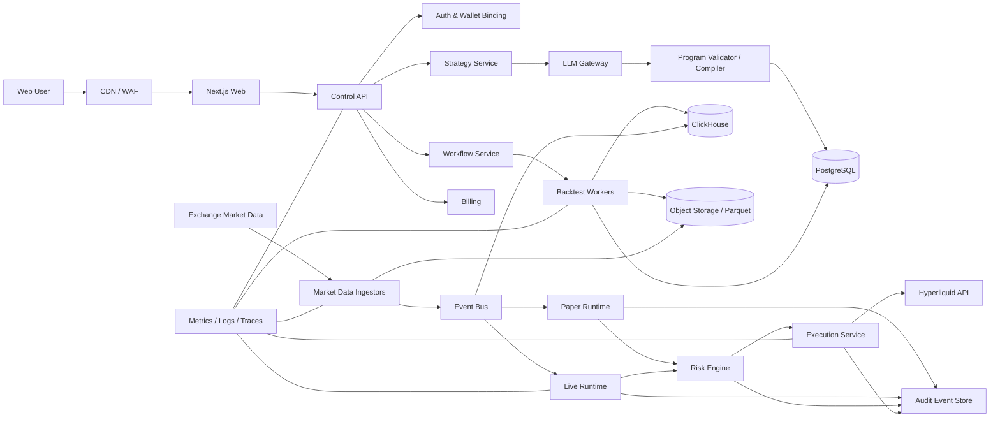
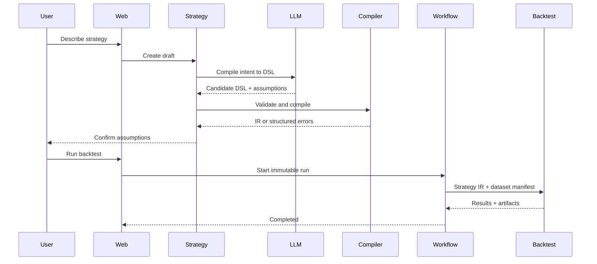
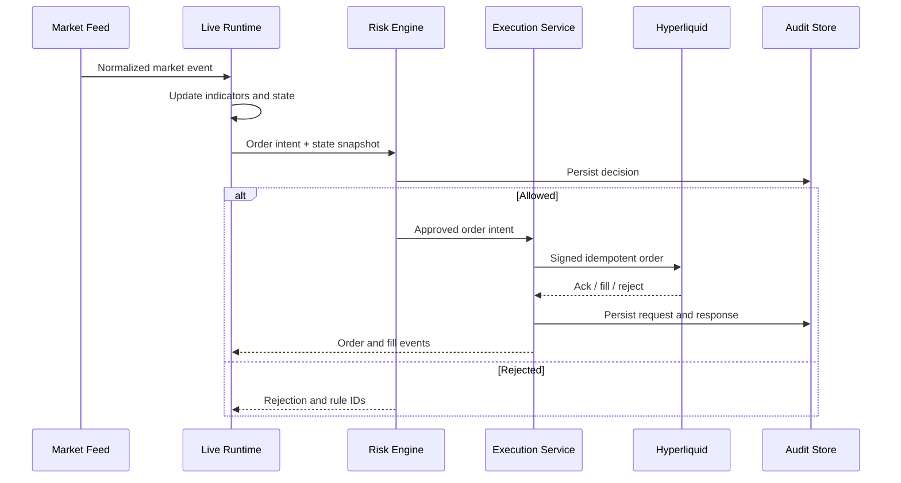

# 技术架构：Crypto Strategy Studio

状态：Draft v0.1  
对应产品规格：[PRODUCT_SPEC.md](PRODUCT_SPEC.zh-CN.md)

## 1. 架构目标

系统需要同时满足以下性质：

- 策略结果可复现。
- AI 不在可信交易边界内。
- 回测、模拟和实盘共享策略语义。
- 市场数据可以追溯来源、时间和质量。
- 钱包授权最小化，平台不托管资产。
- 订单具有幂等、对账、审计和紧急停止能力。
- MVP 可以快速迭代，关键服务又能独立扩展。

## 2. 核心架构原则

### 2.1 AI 编程，确定性沙箱执行

LLM 输出调用平台 Strategy SDK 的受约束 TypeScript 程序。程序经过 AST 静态检查、TypeScript 编译、能力分析和内容哈希后，在 QuickJS/WASM 沙箱中执行。回测、模拟和实盘只运行已验证且固定哈希的程序；LLM 不能直接调用交易接口。内部 IR 只负责审计、能力声明和优化，不再要求表达所有用户意图。

### 2.2 控制平面与交易平面隔离

- 控制平面：用户、策略、版本、回测任务、计费和页面。
- 数据平面：市场数据采集、标准化和存储。
- 交易平面：实时策略运行、风控、签名和下单。

交易平面使用独立网络、凭据、权限和部署；控制平面被攻破时不应直接获得下单能力。

### 2.3 原始事件不可变，派生结果可重建

原始行情、策略版本、订单意图、风控决策、交易所响应和成交记录均采用 append-only 记录。图表、指标和报表是可重建的派生结果。

### 2.4 同一语义，不同运行模式

Backtest、Paper 和 Live 使用同一策略 IR、指标实现和信号状态机。它们只替换：

- 数据时钟。
- Broker adapter。
- Fill model。
- 资金与仓位来源。

## 3. 总体架构



## 4. 服务划分

### 4.1 Web App

职责：

- 登录、钱包绑定和套餐页面。
- 对话、规则树和策略版本界面。
- 图表、回测报告、Paper/Live 控制台。
- 分享页、策略库和风险设置。

不承担：策略计算、密钥保存、交易签名和权威状态判断。

### 4.2 Control API

职责：

- 对外 API/BFF。
- 权限、配额和资源所有权校验。
- 策略、回测、部署和通知命令。
- 聚合 PostgreSQL 与分析服务结果。

所有改变状态的请求必须使用 idempotency key。

### 4.3 LLM Gateway

职责：

- 封装多个模型供应商。
- 管理系统提示、工具定义和模型版本。
- 结构化输出、重试、限流和成本统计。
- 记录输入输出的哈希、模型和提示版本。
- 进行提示注入和敏感内容防护。

LLM Gateway 没有市场交易凭据，也不能访问 Execution Service。

### 4.4 Strategy Service

职责：

- 保存自然语言意图和策略版本。
- 调用 LLM Gateway 生成候选策略程序。
- 执行 AST 安全、类型、SDK 能力和资源校验。
- 编译并生成不可变程序哈希及内部 IR。
- 生成自然语言解释和规则树。
- 管理策略状态和实盘资格门禁。

### 4.5 Market Data Ingestors

职责：

- 通过 WebSocket/REST 获取行情。
- 保存原始消息并附加接收时间。
- 处理重连、心跳、限流和数据补拉。
- 检查时间倒退、重复、序列缺口和异常值。
- 标准化 symbol、venue、时间、价格和数量精度。

首发数据：

- Candle/OHLCV。
- Trades。
- Mark、Oracle 和 Mid price。
- Funding rate。
- Open interest。
- L2 book snapshot/updates，为 P1 滑点模型预留。
- Liquidation events，为 P1 分析预留。

历史回测的已实现底座见[历史行情数据管线](DATA_PIPELINE.zh-CN.md)：原始粒度统一为 1m，按月保存不可变 Parquet 与 SHA-256 manifest；Kraken `XBTUSD` 作为十年单一市场现货基准，Binance Vision `BTCUSDT` 用于快速批量验证，Hyperliquid API 用于近期永续数据。不同 venue/instrument 的序列不得静默拼接。

### 4.6 Backtest Service

职责：

- 加载固定版本的策略 IR 和数据快照。
- 计算指标、信号、订单、成交、资金费和权益。
- 模拟手续费、滑点、杠杆和爆仓。
- 生成指标、交易列表和可视化数据。
- 产出可复现 manifest。

回测 manifest 至少包含：

- strategy_version_id 与 IR hash。
- engine_version。
- dataset snapshot/version。
- symbol、venue、interval、start/end。
- fee/funding/slippage/liquidation 配置。
- 初始资金和风险配置。
- 随机种子，如使用随机模拟。

### 4.7 Paper Runtime

职责：

- 消费实时市场事件。
- 使用与实盘相同的策略状态机。
- 通过 Simulated Broker 生成成交。
- 保存持仓、权益和运行心跳。
- 断线恢复后进行事件补放。

Paper Runtime 是 Live Runtime 的发布前验证环境，不应另写一套简化策略逻辑。

### 4.8 Live Runtime

职责：

- 固定加载一个已获批准的策略版本。
- 消费实时事件并产生 Order Intent。
- 将每个 Intent 提交给 Risk Engine。
- 保持策略状态、指标窗口和运行心跳。
- 无法恢复或对账时进入 `PAUSED_SAFE`。

Live Runtime 不能绕过 Risk Engine 访问 Execution Service。

### 4.9 Risk Engine

职责：

- 校验允许的 venue、symbol、side 和 order type。
- 限制单笔、单策略、单账户仓位和杠杆。
- 检查每日亏损和最大回撤。
- 检查数据新鲜度、价差和异常价格。
- 冲突时只允许 reduce-only。
- 返回 `ALLOW`、`REJECT` 或 `ALLOW_WITH_ADJUSTMENT`。

风险决策必须保存输入快照、命中规则和输出，不允许只有一条自由文本原因。

### 4.10 Execution Service

职责：

- 使用受限 API Wallet 签名交易动作。
- 将内部订单转换为交易场所请求。
- 使用 client order ID 保证幂等。
- 管理 submit/cancel/replace 和重试。
- 接收订单、成交和仓位事件。
- 定期与交易场所对账。
- 执行 Dead Man's Switch。

Execution Service 不解析策略，也不调用 LLM。

### 4.11 Workflow Service

用于长任务和可靠状态转换：

- 数据回填。
- 回测任务。
- Paper/Live 部署和停止。
- 钱包授权验证。
- 交易状态对账。
- 通知重试。
- 账单和额度重置。

## 5. 策略程序与内部 IR

用户意图的主要承载物已经改为策略程序。完整程序模型和当前实现见[策略程序设计](STRATEGY_PROGRAM.zh-CN.md)。本节保留的 DSL 用作可选内部 IR、规则摘要、静态能力和审计表达，完整细节见[内部 DSL/IR 设计](STRATEGY_DSL.zh-CN.md)。

### 5.1 设计原则

- 用户程序必须通过受约束 Strategy SDK 和隔离沙箱执行。
- JSON 可序列化，有明确版本。
- 每个字段有单位和数据类型。
- 条件可以解释和绘图。
- 内部 IR 可以抽取数据依赖、动作、状态和风险，不要求能还原所有程序控制流。
- 交易动作仍必须转换为结构化 Order Intent 并经过独立风险引擎。
- 新增语义必须通过版本升级，不能静默改变旧策略结果。
- 每个策略明确标注 `BACKTEST_ONLY`、`PAPER_ELIGIBLE` 或 `LIVE_ELIGIBLE` 能力级别。

### 5.2 示例

```json
{
  "dslVersion": "1.0",
  "market": {
    "venue": "hyperliquid",
    "instrument": "BTC-PERP",
    "interval": "1h"
  },
  "features": {
    "emaFast": { "type": "ema", "source": "close", "length": 20 },
    "emaSlow": { "type": "ema", "source": "close", "length": 50 },
    "funding": { "type": "funding_rate" },
    "oiChange24h": { "type": "pct_change", "source": "open_interest", "periods": 24 }
  },
  "entry": {
    "side": "long",
    "all": [
      { "crossesAbove": ["emaFast", "emaSlow"] },
      { "lt": ["funding", 0] },
      { "gt": ["oiChange24h", 0.05] }
    ],
    "cooldownBars": 12
  },
  "exit": {
    "stopLoss": { "type": "percent", "value": 0.02 },
    "takeProfit": { "type": "riskReward", "value": 2.0 },
    "maxHoldingBars": 72
  },
  "sizing": {
    "type": "riskPercent",
    "value": 0.01
  },
  "constraints": {
    "maxLeverage": 2,
    "maxConcurrentPositions": 1
  }
}
```

### 5.3 校验层级

1. JSON Schema：字段、类型、枚举、必填项。
2. 语义校验：引用存在、周期合理、单位匹配。
3. 数据校验：需要的数据是否可用且历史长度足够。
4. 风险校验：止损、杠杆、仓位是否满足产品上限。
5. 可执行性校验：执行场所是否支持相应订单语义。

### 5.4 编译产物

DSL 编译为不可变策略 IR：

- 指标依赖 DAG。
- 信号布尔表达式。
- 状态机。
- 仓位和退出规则。
- 数据 warm-up 要求。
- 能力依赖列表。

IR 使用 canonical serialization 计算哈希，作为回测和部署身份的一部分。

## 6. 关键数据流

### 6.1 创建和回测



### 6.2 实时受控执行



### 6.3 对账和安全暂停

1. Execution Service 定期拉取交易所订单、成交、余额和仓位。
2. 与内部投影比较。
3. 可自动解释的小偏差产生修正事件。
4. 无法解释的仓位差异使账户进入 `RECONCILIATION_REQUIRED`。
5. Risk Engine 拒绝所有增加风险的订单，只允许 reduce-only。
6. 通知用户和运维，保留完整证据。

## 7. 数据架构

### 7.1 PostgreSQL：业务权威数据

主要实体：

- `users`
- `wallet_connections`
- `strategies`
- `strategy_versions`
- `strategy_compilations`
- `backtest_runs`
- `deployments`
- `risk_policies`
- `order_intents`
- `orders`
- `fills`
- `position_snapshots`
- `subscriptions`
- `notifications`
- `audit_events`

关键原则：

- 策略版本不可变。
- 金额、价格和数量使用 decimal/numeric 或定点整数，禁止 float 作为权威交易值。
- 所有时间使用 UTC 和带时区时间戳。
- 业务表使用 UUIDv7/ULID 等时间有序 ID。
- 多租户查询必须在应用层和数据库策略层双重限制。

### 7.2 ClickHouse：市场与分析数据

数据集：

- 标准化 trades。
- candles。
- mark/oracle/mid prices。
- funding 与 open interest。
- L2 snapshots/updates。
- liquidation events。
- 策略信号和权益时间序列。

按 venue、instrument、event_date 分区；以 event_time 和 ingestion_time 同时记录延迟与迟到事件。

### 7.3 Object Storage：原始数据和制品

- 原始交易所消息，按小时生成压缩 Parquet。
- 回测数据快照 manifest。
- 大型回测结果和图表序列。
- 导出文件和审计归档。

原始数据只追加；生命周期策略将热数据转为低成本存储。

### 7.4 Redis

- 短期缓存。
- 限流和分布式租约。
- 实时运行状态投影。
- WebSocket fan-out。

Redis 不作为订单、仓位或策略版本的唯一权威存储。

### 7.5 Event Bus

主题建议：

- `market.raw.<venue>`
- `market.normalized.<venue>.<instrument>`
- `strategy.signal`
- `order.intent`
- `risk.decision`
- `execution.order`
- `execution.fill`
- `account.reconciliation`
- `notification.requested`

消息包含 event ID、schema version、event time、ingestion time、producer 和 trace ID。

## 8. 技术选型

### 8.1 推荐栈

| 层级 | 选择 | 原因 |
|---|---|---|
| Web | Next.js + React + TypeScript | SSR、产品迭代快、生态成熟 |
| UI | Tailwind CSS + shadcn/ui | 快速建立一致设计系统 |
| 图表 | TradingView Lightweight Charts | 适合金融K线和自定义标记 |
| Control API | Fastify + TypeScript | 轻量、类型友好、性能和插件生态平衡 |
| Schema | TypeBox/JSON Schema + OpenAPI | DSL、事件和 API 共用契约 |
| 分析/回测 | Python + FastAPI workers | 数据科学生态和验证工具成熟 |
| DataFrame | Polars + NumPy | 列式计算、速度和内存效率 |
| 加速 | Numba，仅用于已验证热点 | 避免过早引入 C++/Rust |
| Workflow | Temporal | 可靠执行长任务、重试和补偿流程 |
| Event bus | NATS JetStream | 运维相对轻、适合事件驱动和持久订阅 |
| 业务数据库 | PostgreSQL | 事务、约束和成熟生态 |
| 分析数据库 | ClickHouse | 高频时序与大规模聚合查询 |
| 缓存 | Redis | 限流、缓存和实时状态 |
| 对象存储 | S3-compatible storage | 原始数据、Parquet和制品 |
| 身份 | 托管 OIDC + SIWE 钱包绑定 | 降低认证安全负担 |
| 支付 | 经预审的 Merchant of Record/支付机构 | 加密交易相关软件可能属于受限行业，不能默认 Stripe 可用 |
| 可观测性 | OpenTelemetry + Grafana stack | 统一 traces、metrics、logs |
| 错误追踪 | Sentry | 前后端异常聚合 |
| IaC | Terraform | 可审查、可复现基础设施 |
| CI/CD | GitHub Actions | 常规测试、构建和部署流程 |

### 8.2 为什么采用 TypeScript + Python

- TypeScript 负责产品、API、实时连接和交易集成，减少前后端契约摩擦。
- Python 负责研究、指标和回测，利用成熟数值生态。
- 两者通过版本化 JSON Schema、事件和 gRPC/HTTP 接口连接。
- MVP 不引入 Rust/Go；只有市场数据吞吐或执行延迟经过测量成为瓶颈后再重写局部服务。

### 8.3 回测引擎策略

不直接把任一开源回测框架当作产品权威引擎。可以借鉴或用于结果交叉验证，但核心引擎需要控制以下加密永续语义：

- Funding 时间和计算。
- Mark/Oracle 与成交价格差异。
- Maker/Taker 判定。
- 杠杆、保证金和爆仓。
- 24/7时间线。
- 数据缺口和交易场所特有规则。

MVP 采用事件驱动的 Bar 级引擎；P1 再增加 trade/L2 级成交模拟。

### 8.4 LLM 选型策略

不把产品绑定到单一模型：

- 通过 provider adapter 支持至少两个供应商。
- 使用结构化输出和严格 schema。
- 建立固定的策略意图测试集。
- 按编译成功率、语义正确率、延迟和成本评估模型。
- 模型升级必须跑回归测试，不能静默影响既有策略。

LLM 不用于权威数值计算；所有指标、收益和风险由确定性代码计算。

## 9. 部署建议

### 9.1 MVP

- AWS 作为主要云。
- ECS Fargate 承载 API、采集器和 worker，避免过早维护 Kubernetes。
- RDS PostgreSQL。
- ElastiCache Redis。
- S3 保存原始行情和 Parquet。
- ClickHouse Cloud 承载分析数据。
- Temporal Cloud 承载工作流。
- NATS 使用托管服务或小规模高可用集群。
- Cloudflare 提供 DNS、CDN、WAF 和基础 DDoS 防护。

### 9.2 区域

控制平面首期使用一个主区域。市场数据采集和交易执行选择靠近交易场所网络质量较好的区域，并通过实际延迟测试决定，不在设计阶段假定最低延迟区域。

系统首期不是高频交易，可靠性和数据一致性优先于亚毫秒延迟。

### 9.3 环境

- Local：Docker Compose，使用模拟交易场所。
- Dev：共享开发环境，只允许 testnet/paper。
- Staging：生产拓扑缩小版，允许受控 testnet。
- Production：Paper 和 Live 凭据、网络、数据库权限隔离。

## 10. 安全架构

### 10.1 钱包与密钥

- 不收集 seed phrase 或主钱包私钥。
- 用户在客户端签署 API Wallet 授权。
- API Wallet 私钥加密保存于 KMS/HSM 保护的密钥系统。
- 解密和签名只发生在隔离的 Execution Service。
- 每个用户/账户使用独立密钥和可撤销授权。
- 禁止提现和转账能力；交易权限与查询权限分开。

更严格的后续方案是远程签名服务或用户侧签名代理，需在可用性和安全性之间另行评估。

### 10.2 服务权限

- 默认拒绝的网络策略。
- LLM/Strategy 服务无法访问签名服务。
- Execution Service 只接受 Risk Engine 已签名的内部授权请求。
- 生产访问使用短期身份凭据和审计。
- 管理后台不能直接生成交易订单。

### 10.3 应用安全

- 钱包签名包含 domain、nonce、chain、issued-at 和 expiration。
- 防重放、CSRF、SSRF、XSS、SQL注入和越权测试。
- 所有 Webhook 验签。
- 敏感字段不进入普通日志和分析平台。
- 依赖和容器镜像持续扫描。
- 上线实盘前进行外部安全评估和渗透测试。

### 10.4 Kill Switch 层级

1. 单策略暂停。
2. 单账户只减仓。
3. 单品种禁止开仓。
4. 单交易场所暂停。
5. 全局实盘暂停。
6. 撤销 API Wallet 授权。

Kill Switch 不能依赖 LLM 或普通前端可用性。

## 11. 一致性与正确性测试

所有能力变更均受[泛化优先准入规范](GENERALIZATION_POLICY.zh-CN.md)约束。架构评审必须先确认可复用语义原语，再检查其在契约、验证器、运行时和产品层的端到端一致性；单一样例或单次模型输出通过不构成完成证据。

### 11.1 黄金策略测试集

至少维护 20 个固定策略：

- 单均线/双均线。
- RSI 超买超卖。
- 突破和追踪止损。
- Long/Short。
- Funding 条件。
- Open Interest 条件。
- 同一根 K 线同时触发止盈止损的边界情况。
- 数据缺口、重复和乱序。

每个策略有固定数据快照和预期信号、订单、成交、费用与最终权益。

### 11.2 模式一致性

使用同一段录制市场数据，分别送入 Backtest replay 和 Paper Runtime，要求：

- 指标值一致。
- 信号时间一致。
- Order Intent 一致。
- 在相同 Fill Model 下权益一致。

### 11.3 交易适配器测试

- Testnet 集成测试。
- 重复提交和幂等测试。
- 超时但交易所已接收的场景。
- 部分成交、撤单失败和状态乱序。
- WebSocket 断线和 REST 对账。
- Dead Man's Switch。

### 11.4 LLM 编译评测

建立不少于 200 条自然语言策略样本，标注：

- 预期 DSL。
- 必须澄清的问题。
- 应拒绝或降级的意图。
- 风险字段。

上线门槛不只看 JSON 合法率，还要看语义准确率和错误是否能被校验器拦截。

每个问题修复必须同时加入原始回归、参数变体、结构变体和边界/拒绝用例。开发集可以用于修复，冻结测试集与盲测集不得反向参与提示词或规则调试。

## 12. 可观测性与 SLO

MVP 建议目标：

- Control API 可用性：99.9%。
- 市场数据事件 p95 延迟：小于 2 秒，具体按数据源测量。
- 策略运行心跳缺失检测：小于 30 秒。
- 订单状态无法确认后的安全暂停：小于 60 秒。
- Critical 风险和执行事件审计覆盖率：100%。
- 未审计订单：0。

核心仪表盘：

- 每个数据源的连接、延迟、缺口和重连。
- 每个运行策略的心跳和事件滞后。
- Intent -> Risk -> Submit -> Ack -> Fill 延迟。
- 订单拒绝、重复、未知状态和对账差异。
- 回测队列、耗时和失败率。
- LLM 编译成功率、澄清率、成本和语义评测得分。

## 13. 仓库建议结构

```text
apps/
  web/                    # Next.js
  api/                    # Fastify control API
services/
  strategy-compiler/      # TypeScript DSL validation/compiler
  market-ingestor/        # TypeScript WebSocket/REST collectors
  backtest-worker/        # Python engine and workers
  paper-runtime/          # TypeScript deterministic runtime
  live-runtime/           # TypeScript deterministic runtime
  risk-engine/            # TypeScript isolated service
  execution-hyperliquid/  # TypeScript venue adapter and signer
packages/
  contracts/              # JSON Schema, OpenAPI, generated types
  strategy-dsl/           # DSL definitions and fixtures
  indicators-ts/          # Runtime indicators
  ui/                     # Shared UI system
python/
  strategy_models/        # Generated Pydantic contracts
  indicators/             # Backtest indicators
  backtest/               # Event-driven engine
infra/
  terraform/
  docker/
docs/
  PRODUCT_SPEC.md
  STRATEGY_PROGRAM.md
  STRATEGY_DSL.md
  TECH_ARCHITECTURE.md
  BUSINESS_PLAN.md
```

TypeScript 与 Python 的指标实现需要共用黄金向量测试；不能只依赖“公式看起来一样”。

## 14. 技术实施顺序

### Milestone 1：策略内核

- DSL v1 与 JSON Schema。
- 编译器和结构化错误。
- 黄金策略样本。
- 单机历史数据加载和回测。

### Milestone 2：数据与可信回测

- Hyperliquid 数据采集。
- 原始数据落盘和标准化。
- Funding、费用、滑点和爆仓模型。
- 可复现 manifest 和回测报告。

### Milestone 3：产品 MVP

- Web、账户和策略库。
- 对话生成与规则树。
- 异步回测和分享页。
- 计费和运营后台。

### Milestone 4：实时模拟

- Event bus。
- Paper Runtime。
- 基础 Risk Engine。
- 监控、恢复和通知。

### Milestone 5：受控实盘

- API Wallet 授权。
- 隔离的 Execution Service。
- 幂等、对账和 Kill Switch。
- 邀请制小额实盘。

## 15. 关键架构决策记录

| 决策 | 当前选择 | 重新评估触发条件 |
|---|---|---|
| 策略表达 | 受约束 DSL | 用户需求大量无法表达 |
| 回测粒度 | Bar 级事件驱动 | Paper/Live 偏差主要来自成交模型 |
| 首发场所 | Hyperliquid | API、地区或可靠性无法满足上线要求 |
| 实盘边界 | 非托管 API Wallet | 用户安全或转化无法接受 |
| 核心语言 | TypeScript + Python | 实测性能或安全需求需要局部重写 |
| 业务数据 | PostgreSQL | 无 |
| 市场分析数据 | ClickHouse + Parquet | 数据量远低于预期，可暂时合并至 Postgres |
| 服务编排 | ECS Fargate | 服务数量和调度复杂度需要 Kubernetes |

## 16. 外部接口事实与设计影响

- Hyperliquid 提供公开 API、WebSocket、testnet、API Wallet 和下单接口，可支撑首发集成。
- API Wallet 可以代表用户执行交易动作；平台必须将其与主钱包、转账和提现能力隔离。
- Builder Code 允许用户授权应用对其路由的成交收取透明费用，可形成交易收入。
- 普通 candle snapshot 只提供最近有限数量的数据；官方历史归档也不保证完整和及时，因此需要从第一天建设自有采集、质量检测和 Parquet 归档。

参考：

- [Hyperliquid API](https://hyperliquid.gitbook.io/hyperliquid-docs/for-developers/api)
- [Exchange endpoint and API wallet](https://hyperliquid.gitbook.io/Hyperliquid-docs/for-developers/api/exchange-endpoint)
- [Builder codes](https://hyperliquid.gitbook.io/hyperliquid-docs/trading/builder-codes)
- [Historical data](https://hyperliquid.gitbook.io/hyperliquid-docs/historical-data)
- [Perpetual market data](https://hyperliquid.gitbook.io/hyperliquid-docs/for-developers/api/info-endpoint/perpetuals)
